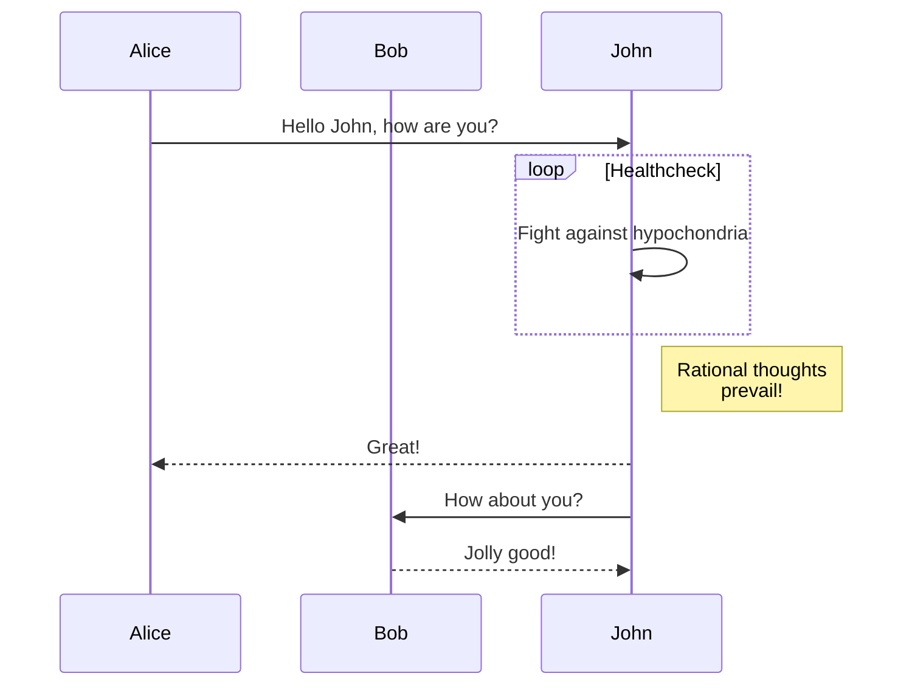
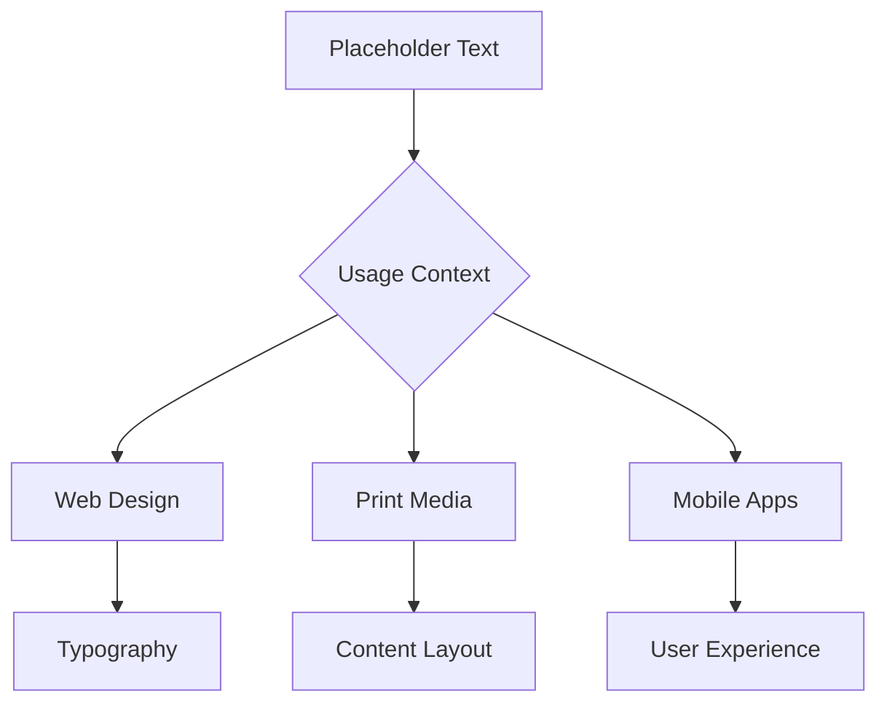

Sed ut perspiciatis unde omnis iste natus error sit voluptatem accusantium doloremque laudantium, totam rem aperiam, eaque ipsa quae ab illo inventore veritatis et quasi architecto beatae vitae dicta sunt explicabo.

## Understanding Placeholder Content

Nemo enim ipsam voluptatem quia voluptas sit aspernatur aut odit aut fugit, sed quia consequuntur magni dolores eos qui ratione voluptatem sequi nesciunt. Neque porro quisquam est, qui dolorem ipsum quia dolor sit amet, consectetur, adipisci velit.



### The Psychology Behind Dummy Text

Sed quia non numquam eius modi tempora incidunt ut labore et dolore magnam aliquam quaerat voluptatem. Ut enim ad minima veniam, quis nostrum exercitationem ullam corporis suscipit laboriosam, nisi ut aliquid ex ea commodi consequatur.

Quis autem vel eum iure reprehenderit qui in ea voluptate velit esse quam nihil molestiae consequatur, vel illum qui dolorem eum fugiat quo voluptas nulla pariatur.



## Modern Applications in Digital Design

At vero eos et accusamus et iusto odio dignissimos ducimus qui blanditiis praesentium voluptatum deleniti atque corrupti quos dolores et quas molestias excepturi sint occaecati cupiditate non provident.

```java
public class PlaceholderText {
    public static void main(String[] args) {
        System.out.println("Lorem ipsum dolor sit amet, consectetur adipiscing elit.");
    }
}
```

### Design Systems and Lorem Ipsum

1. **Component Libraries**: Similique sunt in culpa qui officia deserunt mollitia animi
2. **Prototyping Tools**: Id est laborum et dolorum fuga
3. **Content Management**: Et harum quidem rerum facilis est et expedita distinctio
4. **User Testing**: Nam libero tempore, cum soluta nobis est eligendi optio

## Best Practices for Placeholder Text

Temporibus autem quibusdam et aut officiis debitis aut rerum necessitatibus saepe eveniet ut et voluptates repudiandae sint et molestiae non recusandae. Itaque earum rerum hic tenetur a sapiente delectus.

### When to Use Lorem Ipsum

- **Early Design Phases**: Ut aut reiciendis voluptatibus maiores alias consequatur aut perferendis doloribus
- **Client Presentations**: Asperiores repellat optio cum ab
- **Development Testing**: Cumque nihil impedit quo minus id quod maxime placeat
- **Layout Validation**: Facere possimus, omnis voluptas assumenda est

## Alternative Approaches

Omnis dolor repellendus. Temporibus autem quibusdam et aut officiis debitis aut rerum necessitatibus saepe eveniet ut et voluptates repudiandae sint et molestiae non recusandae.

### Industry-Specific Placeholders

Lorem ipsum has evolved beyond its classical roots. Modern designers often use context-specific placeholder text that better represents the final content:

- **Technology**: API documentation snippets
- **E-commerce**: Product descriptions and reviews
- **Healthcare**: Medical terminology and procedures
- **Education**: Course descriptions and syllabi

## The Future of Placeholder Content

Itaque earum rerum hic tenetur a sapiente delectus, ut aut reiciendis voluptatibus maiores alias consequatur aut perferendis doloribus asperiores repellat. Sed ut perspiciatis unde omnis iste natus error sit voluptatem accusantium doloremque laudantium.

Totam rem aperiam, eaque ipsa quae ab illo inventore veritatis et quasi architecto beatae vitae dicta sunt explicabo nemo enim ipsam voluptatem quia voluptas sit aspernatur aut odit aut fugit.
